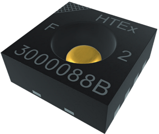

# HTE501 I2C with Arduino

 

<!--   -->
 

## QUICK START GUIDE  

### Components 
- HTE501
- Arduino
- Breadboard 
- Wire jumper cable  

| Step |                                                                                                                                                             |
|------|-------------------------------------------------------------------------------------------------------------------------------------------------------------|
| 1    | Connect the HTE501 sensor module with Arduino according to the following scheme: __Please note: For this connection scheme the I2C address is 0x40.__     |
| 2    | Download and install the Arduino IDE (https://www.arduino.cc/en/software). Version >1.8.7 recommended.                                                            |
| 3    | Download the ZIP File of this project.|
| 4    | Open the arduino software.|
| 5    | Go to:   |
| 6    | Search for the downloaded ZIP File and open it.|
| 7    | Go to: |
| 8    | Connect the Arduino to your PC via the USB cable. Select Board “Arduino Uno” and the appropriate COM-Port from Tools menu and upload the sketch |
| 9    | When the upload is finished, open the the "Serial Monitor" with the key combination (Control + Shift + M) or via the menu bar:    |

### I2C address
The sensor‘s I2C base address is 0x40 (without R/W bit). Pins A1...A3 overrule the I2C base address.(for more information check the data sheet)  
To make it easier to find the I2C address, there is a function contained in this library called "findSensor".  
### No matching I2C address
You have two ways to match the I2C addresses. The first would be to call the library in the Arduino file with the correct address. Or you can change the connections to the pins A1 to A3.
  

 

## License 
See [LICENSE](LICENSE).
